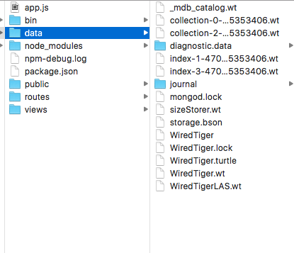
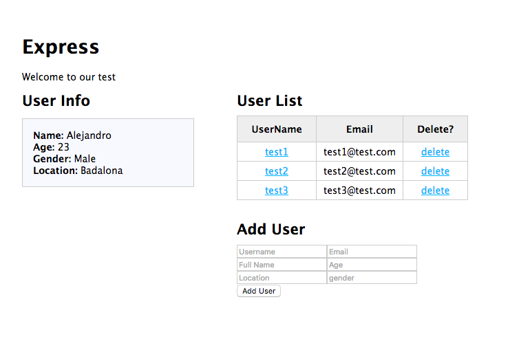
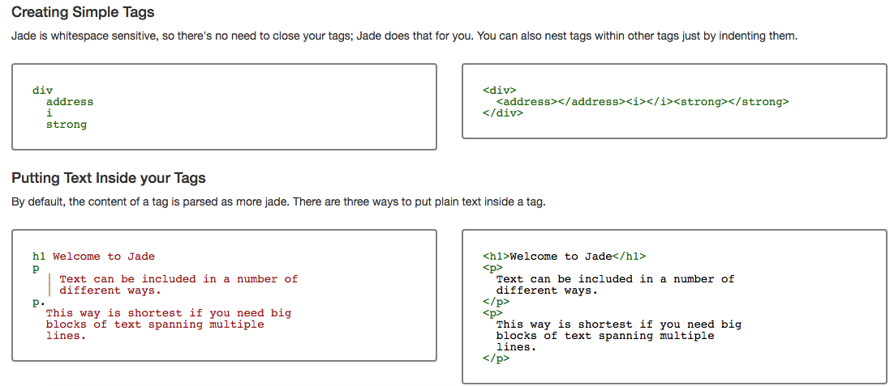
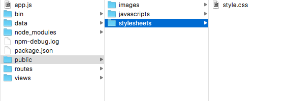
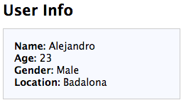

## Tutorial NodeJS - Mongo DB - Express 
 


## Description:

- *This project will be built under NODE JS, using its framework Express and backed by MongoDB as data base. In this tutorial we will see from the installation of everything needed for the project to its development , seeing three types of sentences (get, insert and delete) in MongoDB . The project idea is do a database control, who can add, delete and show info about users.*


##  Objectives  :
- 1. Install MongoDB ,specify the work path, and make a test running it in **localhost**.
- 2. Download express, and asure nodeJS and Mongo are updated
- 3. Download *nodetest2* and change the correct files for developing properly the project, test it in **localhost**
- 4. See example users (adding from Mongo console) function works 
- 5. Add users (from HTML page) function works
- 6. Delete users (from HTML page) function works and posted it in Heroku.


## Installing MongoDB

### Step 1. MongoDB
- Get mongoDB from: https://www.mongodb.com/download-center , extract and move the extract folder to other place where can work with it (project folder)

```bash
$ cd ~/Download
$ tar xzf mongodb-osx-x86_64-2.2.3.tgz
$ sudo mv mongodb-osx-x86_64-2.2.3 /usr/local/mongodb 
```

/usr/local/mongodb <---- This is the folder where MongoDB are installed, in the step 2, we specify where mongoDB **MUST** work, are different, be carefully


### Step 2. Getting ready!

We must create the folder where mongoDB store and work with all data.

```bash
$ sudo mkdir -p /data
$ sudo chown username /data
```

Specify the path where mongoDB must act with mongod

```bash
mongod --dbpath route/.../data
```



^^ from where you have mongo installed, specify the path

- Asure you have installed Mongo!

```bash
$ mongo -version
```

### Step 3. Working on database

Start MongoDB with **mongod** and make a simple mongo connection with **mongo**.
INIT MONGO CONSOLE FROM WHERE YOU INSTALLED IT:
`/usr/local/mongodb`

- In terminal 1:

```bash
    $ mongod
    MongoDB starting...
```


- In terminal 2:

```bash
$ mongo
MongoDB shell version: 2.2.3
connecting to: test
```

We can add a user manually like...
In this project we will use userlist library.

```mongo
db.userlist.insert({'username' : 'test1','email' : 'test1@test.com','fullname' : 'Test','age' : 30,'location' : 'New York','gender' : 'Male'})
```

---


## Exercise! Building the project



### Step 1. New Project

Create a new folder for your project and create a new express app there


```bash
mkdir myNewExpressProject && cd myNewExpressProject
express
```

- Use this dependencies on the `package.json`: 

```
    "dependencies": {
        "body-parser": "~1.15.1",
        "cookie-parser": "~1.4.3",
        "debug": "~2.2.0",
        "express": "~4.13.4",
        "jade": "~1.11.0",
        "morgan": "~1.7.0",
        "serve-favicon": "~2.3.0"
    }
```

and then `npm install`

- Modify layout.jade too

**What is Jade?** It's a simply, fast and minimal way to write HTML code. 



```jade
doctype html
html
      head
        title= title
        link(rel='stylesheet', href='/stylesheets/style.css')
      body
        block content
        script(src='http://ajax.googleapis.com/ajax/libs/jquery/2.0.3/jquery.min.js')
        script(src='/javascripts/global.js')
```

- **You miss CSS?** You can find the css in the `materials` folder. Use it for this project



- Modify **index.jade** (VIEWS\INDEX.JADE)

```jade
    extends layout
    block content
    h1= title
    p Welcome to our test

    // Wrapper
    #wrapper

        // USER LIST
        h2 User List
        #userList
            table
                thead
                    th UserName
                    th Email
                    th Delete?
                tbody
        // /USER LIST

    // /WRAPPER
```

- And that's it! We can start, if you do all this properly, if you run the project with *npm start*, and **navigate to localhost:3000**, you should see something boring thing... Let's change it to cool project!

- And show the info in some fields-text like...




**So, when we go to localhost:3000 and we can see the user info, simply, it means the connectivity to mongoDB is OK, the changes in code are OK too and now, in this point, we can continue adding some functional things to our program, ADD more users, and DELETE it.**

### STEP 2 - ADD (Insert) info

- We want add more example users, then, we must create the function, path, JSON call... easy, no?
- Asure that you can show the info about the new users, the info shouls refresh automatically!
- In the Chrome console log, you can see the errors and check what fails, you can use break points...(?)

### Step 3 - DELETE info
- As the Add function..., should be something like:

        $.ajax({
                **type: 'DELETE',**
                url: '/users/deleteuser/' + $(this).attr('rel')
                }).done(function( response ) {...

- The changes should automatically refresh the user list in main mpge.

---

##Extra

## Post the project on Heroku

https://devcenter.heroku.com/articles/getting-started-with-nodejs#set-up


